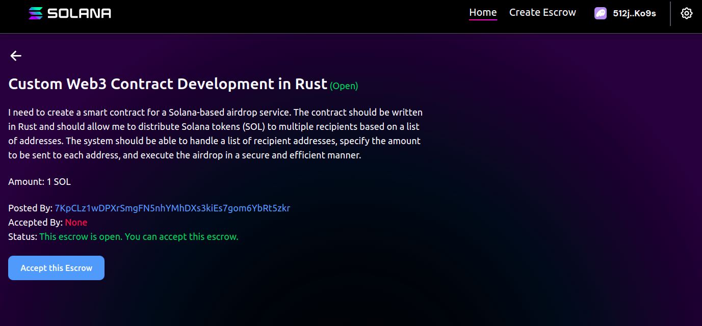
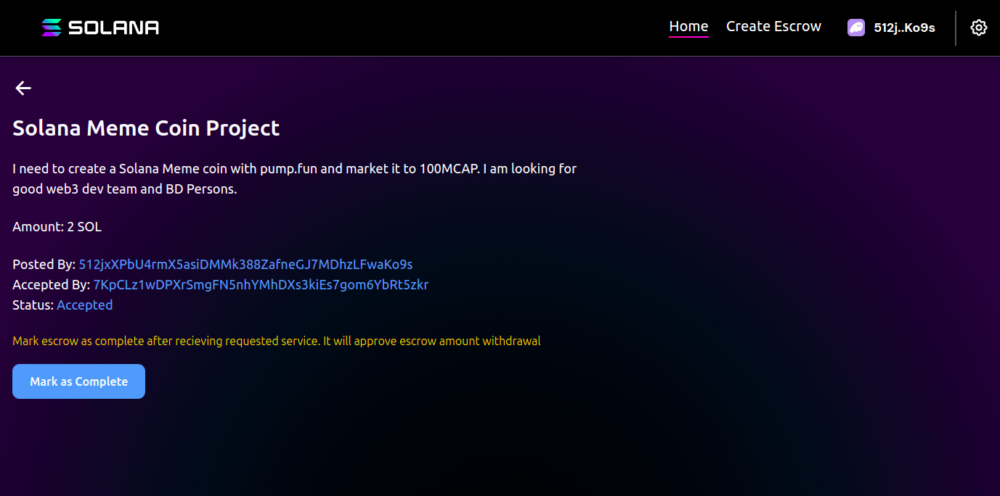

# Solana Escrow Program

A simple escrow implementation written in Rust, designed for locking and releasing SOL based on service agreements between a requester and a service provider.

# Features

- **Create an Escrow** : Requesters lock a specific amount of SOL in the escrow contract while specifying the service requirements.
- **Accept an Offer**: Service providers can accept the offer to deliver the requested service.
- **Approve Fund**: After the service is provided, the requester can approve the service completion by invoking the approve instruction. This marks the contract as approved, allowing the service provider to claim the funds.
- **Claim Funds**: After the service is approved, the service provider can claim the locked funds using the claim instruction.

# screenshot

# 📚Solana Program

